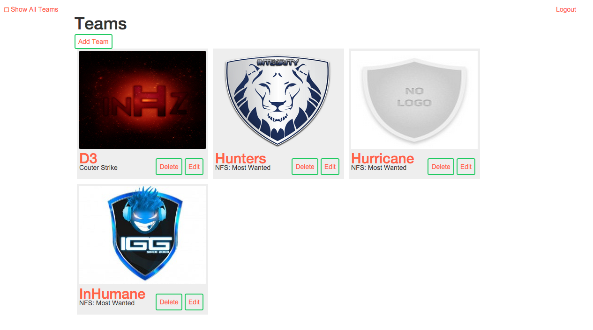

# catalog

A simple application written in python for showcasing International gaming teams and their players.

# Requirement
 - Python 2.7
 - SQLite database
 - Flask framework
 - SQLalchemy ORM
 - Google+ account(for oauth integration)
 - Facebook account(for oauth integration)
 
# Setting up project
To configure the project simple clone the application using command
```
git clone https://github.com/talib570/catalog.git
```

cd into the folder `catalog` using
```
cd catalog
```

run the following command to setup the database
```
python database_setup.py
```

then to enter some dummy records run
```
python initialdbsetup.py
```

and finally start the server using
```
python project.py
```
and navigate to the url `http://localhost:5000/`

### Example screenshots
Main page:

